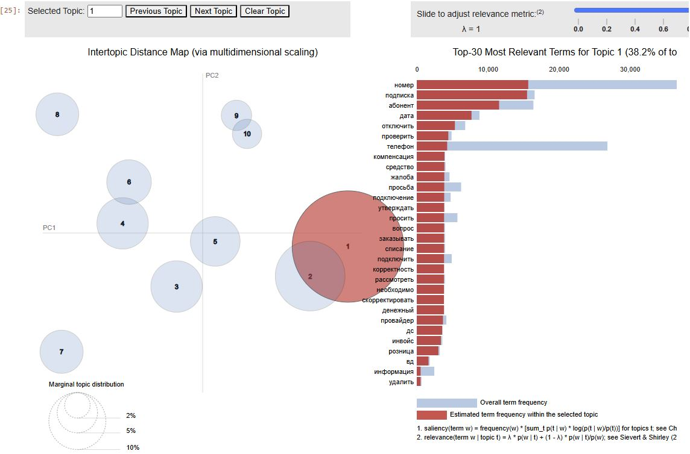

## EDA для Time Series

Выводы EDA:
- Сезонность
- Аномалии
- Статистики
- Тесты на стационарность, автокорреляцию
- Особенности иерархии

[Ноутбук с анализом данных](./notebooks/TS/EDA.ipynb)

## EDA для NLP
Анализ проведен с помощью векторизации Word2Vec, LABSE и BERT

- KMeans показал наилучший результат для эмбеддингов от BERT: разделил датасает на 10 кластеров
- DBSCAN также выделил 12 кластеров, при этом большинство было записано в шум
- Наиболее точная кластеризация была проведена с помощью LDA. Выделены темы:
1. Обращения
   1. Списания/денежные средства
   2. Проблемы с сим-меню
   3. Esim (код активации, qr-код)
   4. Отключение услуги
   5. Учетные записи
2. Информация
   1. Уведомления о плановых работах
   2. Сбой работы (в работе оператора)
3. Черный список
4. Спам

- Саммаризация для тикетов не требуется, т.к. удяются важные слова для кластеризации. Она будет использоваться для статей на вики для технической поддержки

[Ноутбук с анализом данных](./notebooks/NLP/clustering_eda.ipynb)

LDA визуализация
